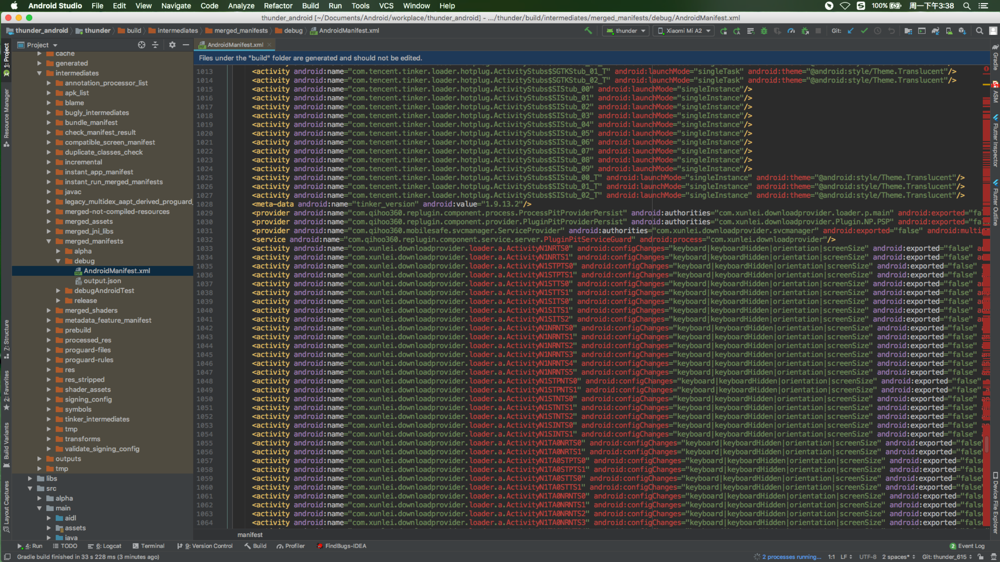

# Replugin源码分析
[Replugin](https://github.com/Qihoo360/RePlugin)是360出品的插件化框架，本文通过源码分析，实现一个最简单的插件化框架
## 什么是插件化
插件化技术最初源于免安装运行apk的想法，这个免安装的apk可以理解为插件。支持插件化的app可以在运行时加载和运行插件，这样便可以将app中一些不常用的功能模块做成插件，一方面减小了安装包的大小，另一方面可以实现app功能的动态扩展。

宿主： 就是当前运行的APP插件： 相对于插件化技术来说，就是要加载运行的apk类文件
## 怎么实现插件化
Android插件化需要解决的三个问题

Replugin怎么解决的三个问题

## ClassLoader

ClassLoader又叫类加载器，是专门处理类加载，一个APP可以存在多个ClassLoader，它使用的是双亲代理模型，如下图所示，创建一个ClassLoader，需要使用一个已有的ClassLoader对象，作为新建的实例的ParentLoader。

当加载类时，如果当前ClassLoader未加载此类，就查询ParentLoader是否加载过，一直往上查找，如果存在就返回，如果都没有，就执行该Loader去执行加载工作。这样避免了类重复加载的浪费。Android中的Loader有：

BootClassLoader 是系统启动时创建的，一般不需要用到。
PathClassLoader 是应用启动时创建的，只能加载内部dex。
DexClassLoader 可以加载外部的dex。
## Replugin框架结构

RePlugin的动态编译方案
在编译时，replugin-replugin-library脚本，会替换代码中的基础类和方法。

## RePlugin特色
RePlugin对比其他插件化，它的强大和特色，在于它只Hook住了ClassLoader。One Hook这个坚持，最大程度保证了稳定性、兼容性和可维护性，当然，One Hook也极大的提高了实现复杂程度性。

### replugin-host-library：
对应com.qihoo360.replugin:replugin-host-lib:xxx依赖，是一个Java工程，由主程序负责引入，是RePlugin的核心工程，负责初始化、加载、启动、管理插件等。

### replugin-host-gradle :
对应com.qihoo360.replugin:replugin-host-gradle:xxx依赖，主要负责在主程序的编译期中生产各类文件：
根据用户的配置文件，生成HostBuildConfig类，方便插件框架读取并自定义其属性，如：进程数、各类型占位坑的数量、是否使用AppCompat库、Host版本、pulgins-builtin.json文件名、内置插件文件名等。
自动生成带 RePlugin 插件坑位的 AndroidManifest.xml文件，文件中带有如：

### replugin-host-library：
对应com.qihoo360.replugin:replugin-host-lib:xxx依赖，是一个Java工程，由主程序负责引入，是RePlugin的核心工程，负责初始化、加载、启动、管理插件等。
### replugin-plugin-gradle：
对应com.qihoo360.replugin:replugin-plugin-gradle:xxx ，是一个Gradle插件，由插件负责引入，主要负责在插件的编译期中：配置插件打包相关信息；动态替换插件工程中的继承基类，如下，修改Activity的继承、Provider的重定向等。

### ClassLoader—RepluginClassLoader—PluginDexClassLoader

利用反射替换

## 占坑

### 为什么要占坑
Android需要再AndroidMainfiest中配置，那AndroidManifest在什么时候注入的？其实这个是在App安装的时候，PackageManagerService就会读取到AndroidManifest里面的配置信息并保存一份到PackageManagerService.Settings当中，那么基本无法动态的改变这份配置信息。如果以后能动态的改变Android中记录的App配置信息，那么我们就不需要占坑了。
正因为一开始就已经将配置AndroidManifest记录到PackageManagerService，里面的记录的Activity的信息，将也会保存到PackageManagerService中。我们使用startActivity的时候，ActivityManagerService将会Activity的合法信息传送到Native层作配置验证，如果无法找到跳转Activity的配置，那么将抛出异常。

提前在宿主声明一些空Activity信息到AndoridManifest当中，然后在使用startActivity后在ActivityManagerService中在跳转到Native层前将替换成员AndroidManifest的空Activity，欺骗验证，然后Native层验证过后，在传回ActivityManagerService层后替换回需要跳转的Activity的信息。这种声明空Activity信息到AndroidManifest的行为，我们就叫做占坑了

插件的Context的替换PluginContext

坑位的分配与回收

